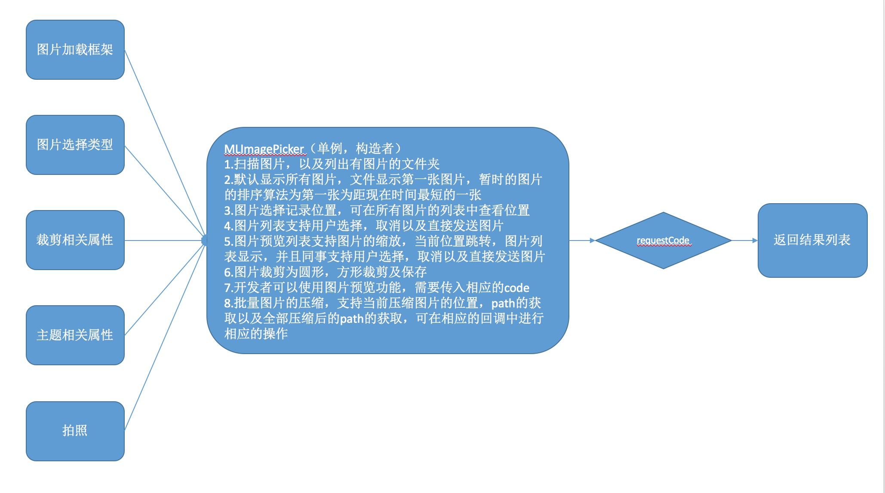
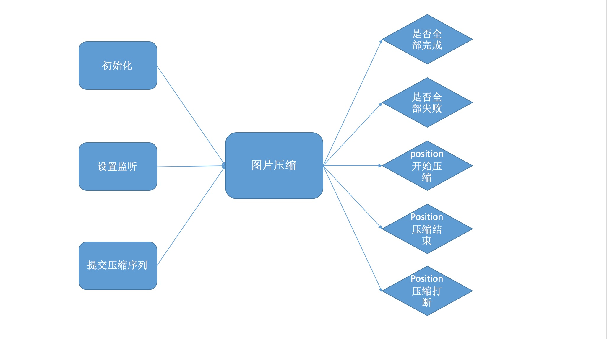

# ImagePickerDemo
图片选择器

### 1.效果预览


### 2.设计思路




### 3.图片选择使用
```
//初始化，可以一起初始化，也可以单个set，看实际需要
 MLImagePicker.getInstance()
                .setImageLoadFrame(new FrescoLoadFrame())
                .setImageMaxSize(9)
                .setChooseType(MLImagePicker.TYPE_CHOOSE_MULTIPLE)
                .setNavigationIconRes(0)
                .setOutputY(800)
                .setOutputX(800)
                .setFocusHeight(800)
                .setFocusWeight(800)
                .setLight(false)
                .setToolbarColor(Color.BLACK)
                .setStatusBarColor(Color.BLACK)
                .setFocusStyle(CropImageView.Style.CIRCLE)
                .setSaveRectangle(true);


//根据不同的resultcode和requestcode获取处理相应的结果
Intent intent = new Intent(MainActivity.this, MLImageListActivity.class);
startActivityForResult(intent, MLImagePicker.CODE_REQUEST_IMG_LIST);

Intent intent = new Intent(MainActivity.this, MLTakePhotoActivity.class);
startActivityForResult(intent, MLImagePicker.CODE_REQUEST_TAKE_PHOTO);

Intent intent = new Intent(MainActivity.this, MLImageListActivity.class);
startActivityForResult(intent, MLImagePicker.CODE_REQUEST_TAKE_PHOTO);

@Override
    protected void onActivityResult(int requestCode, int resultCode, Intent data) {
        super.onActivityResult(requestCode, resultCode, data);
        imageBeanList.clear();
        if (requestCode == MLImagePicker.CODE_REQUEST_IMG_LIST) {
            if (resultCode == MLImagePicker.CODE_RESULT_IMG_LIST) {
                if (data != null) {
                    imageBeanList = data.getParcelableArrayListExtra(MLImagePicker.RESULT_IMG_LIST);
                    imageListAdapter = new ImageListAdapter(MainActivity.this, imageBeanList);
                    sdvImageList.setAdapter(imageListAdapter);
                    ((TextView) findViewById(R.id.tvImagePath)).setText(imageBeanList.toString());
                    List<String> stringList = new ArrayList<>();
                    for (int i = 0; i < imageBeanList.size(); i++) {
                        stringList.add(imageBeanList.get(i).imgPath);
                    }
                    mlBatchCompressPictureUtil.submitAll(stringList);
                }
            }
        } else if (requestCode == MLImagePicker.CODE_REQUEST_TAKE_PHOTO) {
            if (data != null) {
                if (resultCode == MLImagePicker.CODE_RESULT_TAKE_PHOTO) {
                    imageBeanList = data.getParcelableArrayListExtra(MLImagePicker.RESULT_IMG_LIST);
                    imageListAdapter = new ImageListAdapter(MainActivity.this, imageBeanList);
                    sdvImageList.setAdapter(imageListAdapter);
                    ((TextView) findViewById(R.id.tvImagePath)).setText(imageBeanList.toString());

                    CompressPicture compressPicture = new CompressPicture();
                    compressPicture.thirdCompress(new File(imageBeanList.get(0).imgPath));
                } else if (resultCode == MLImagePicker.CODE_RESULT_LOCAL_PHOTO) {
                    ImageBean imageBean = new ImageBean();
                    imageBean.imgPath = data.getStringExtra(MLImagePicker.LOCATION_DEAL_URL);
                    imageBeanList.add(imageBean);
                    imageListAdapter = new ImageListAdapter(MainActivity.this, imageBeanList);
                    sdvImageList.setAdapter(imageListAdapter);
                    ((TextView) findViewById(R.id.tvImagePath)).setText(imageBeanList.toString());
                }
            }
        }
    }

```

### 4.图片压缩
```
//初始化
mlBatchCompressPictureUtil = new MLBatchCompressPictureUtil();

//提交处理
mlBatchCompressPictureUtil.submitAll(stringList);

//设置监听获取结果
mlBatchCompressPictureUtil.setOnBatchCompressListener(new OnBatchCompressListener() {
            @Override
            public void onAllSuccess(List<String> dealPicturePathList) {
                Log.e(TAG, "处理图片的长度：" + dealPicturePathList.size());
                Toast.makeText(MainActivity.this, "处理图片的长度：" + dealPicturePathList.size(), Toast.LENGTH_SHORT).show();
                tvCompressState.setText("全部上传成功" + "\n");
                tvCompressState.append(dealPicturePathList.toString());
            }

            @Override
            public void onAllFailed() {
                tvCompressState.setText("全部上传失败");
            }

            @Override
            public void onThreadProgressStart(int position) {
                tvCompressState.setText("第" + position + "个开始压缩");
            }

            @Override
            public void onThreadFinish(int position, String dealPicturePath) {
                tvCompressState.setText("第" + position + "个压缩完成");
                if (position == 0) {
                    tvImagePath.setText("处理后的图片路径：" + "\n");
                    tvImagePath.append(dealPicturePath + "\n");
                } else {
                    tvImagePath.append(dealPicturePath + "\n");
                }
            }

            @Override
            public void onThreadInterrupted(int position) {
                tvCompressState.setText("第" + position + "个压缩被打断");
            }
        });


```

